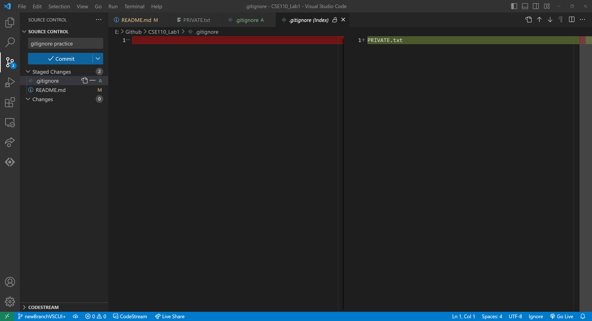

# Big heading

**Bold**

~~Dont look at this~~

> This is a quote

```
I am code
git adddddd
```


## Medium heading
This site was built using [GitHub Pages](https://pages.github.com/)

### Small heading
[lab_screenshots](screenshots/git1.png)

- unordered3
- unordered2
- unordered1

1. ordered 1
2. ordered 2
3. ordered 3

- [x] Use command line git 
- [x] Use VSC UI git
- [x] Make a md file
